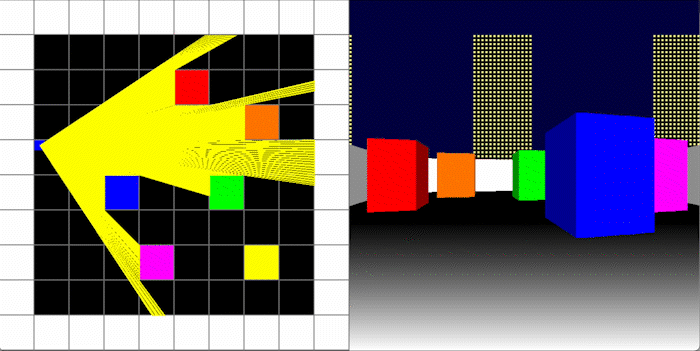
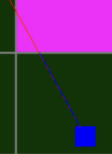
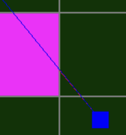

# RayCaster

By casting several rays within a field of view a 3D image can be created. This is done by creating a rectangle for each ray with a center point at the horizontal line. The rectangle increase and decrease in height depending on how long the ray is.

# Horizontal and vertical ray

Each final ray in the field of view is the shortest ray from one horizontal and one vertical ray.

 

Each ray is calculated by first checking where the ray intercepts the closest vertical/horizontal line. If there is a wall at that location the ray is done, otherwise it checks if there is a wall at the next horizontal/vertical line.

# Shading

Shading is easily achieved by using a darker shade for the final ray if the vertical ray is shorter and a ligher shade if the horizontal ray is shorter.

# Code

The code is written in C and uses the library SDL 2
